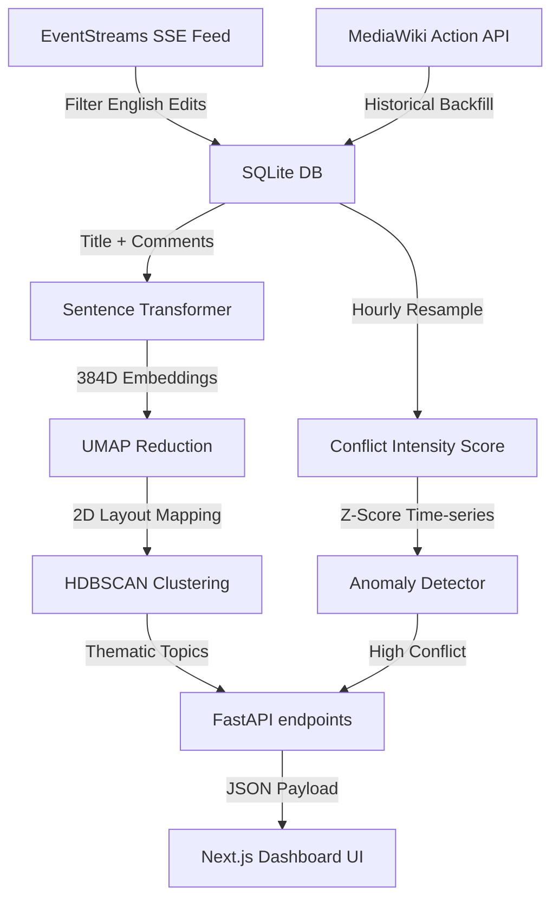

# Tremor — A Seismograph for Wikipedia

Tremor is a real-time analytics dashboard that detects Wikipedia pages currently undergoing "edit wars" (active conflicts and controversies) using unsupervised machine learning. 

Rather than relying purely on LLM API wrappers, Tremor implements **genuine time-series anomaly detection** and **sentence embeddings** to group related disputes visually, serving an LLM explanation layer only as a final summary step.

---

## Architecture & ML Methodology

Tremor's logic is split into distinct, transparent stages:



### 1. Ingestion Pipeline (`app/ingest/`)
- **Live Stream Listener**: Connects to the SSE recentchange feed, capturing edits, users, comments, and size variations.
- **Historical Backfiller**: Connects to the MediaWiki Action API to pull edit logs to establish baselines.

### 2. Conflict & Anomaly Scoring (`app/ml/anomaly.py`)
- **Conflict Intensity Weighting**: A revert is weighted heavily ($5\times$) as it directly represents edit conflicts. Bot actions are dampened ($0.1\times$).
- **Time-Series Z-Score**: Resamples edits into hourly intervals. The scoring compares recent activity (last 24 hours) against historical baselines:
  $$Z = \frac{\mu_{\text{recent}} - \mu_{\text{baseline}}}{\sigma_{\text{baseline}} + \epsilon}$$
- **Dynamic Boosts**: Extra weighting is added for unique editor counts (co-contributor friction) and high revert velocities.

### 3. Sentence Embeddings (`app/ml/embeddings.py`)
- Employs the lightweight `all-MiniLM-L6-v2` sentence-transformer.
- Synthesizes an article profile by combining its title with recent unique edit comments, emphasizing revert reasons.

### 4. Dimensionality Reduction & Clustering (`app/ml/clustering.py`)
- **UMAP Layout**: Reduces high-dimensional embeddings to 2D coordinates for scatter map visualization using cosine distance metrics.
- **HDBSCAN Clustering**: Clusters the UMAP coordinates using Euclidean density, grouping related disputes (e.g. politics, science, tech) while isolating noise.

### 5. LLM Explanation Layer (`app/llm/summarize.py`)
- Resolves conflicts into plain-English. Passes revision comments and statistics to Gemini or Groq to generate a 2-3 sentence summary.
- Implements a rule-based fallback if API keys are not configured.

---

## Folder Structure

```
tremor/
├── backend/
│   ├── app/
│   │   ├── ingest/
│   │   │   ├── stream_listener.py  # SSE Live recentchange listener
│   │   │   └── history_fetcher.py  # MediaWiki History backfiller
│   │   ├── ml/
│   │   │   ├── revert_detect.py    # Revert detection heuristics
│   │   │   ├── anomaly.py          # Time-series anomaly scorer
│   │   │   ├── embeddings.py       # Sentence Embeddings generator
│   │   │   └── clustering.py       # UMAP + HDBSCAN pipeline
│   │   ├── llm/
│   │   │   └── summarize.py        # LLM explanation layer
│   │   ├── routers/
│   │   │   ├── pages.py            # API routes for pages & timelines
│   │   │   └── clusters.py         # API routes for clusters & map
│   │   ├── db.py                   # DB session & initialization
│   │   ├── models.py               # SQLAlchemy schemas
│   │   └── main.py                 # FastAPI application root
│   ├── .env                        # Configuration file
│   └── requirements.txt
│
└── frontend/
    ├── src/
    │   └── app/
    │       ├── globals.css         # Customized dark theme styles
    │       ├── layout.tsx          # Font loading & layout config
    │       └── page.tsx            # Main dashboard component
    └── package.json
```

---

## Quickstart Guide

### Prerequisite Setup

1. **Backend**:
   ```bash
   cd backend
   # Set up virtualenv and install requirements
   python -m venv venv
   .\venv\Scripts\activate
   pip install -r requirements.txt
   ```
2. **Frontend**:
   ```bash
   cd frontend
   npm install
   ```

### Running the Project

1. **Initialize the Database**:
   ```bash
   cd backend
   .\venv\Scripts\python -m app.db
   ```

2. **Backfill Sample Articles**:
   ```bash
   .\venv\Scripts\python -m app.ingest.history_fetcher "Donald Trump" --limit 100
   .\venv\Scripts\python -m app.ingest.history_fetcher "Gaza Strip" --limit 100
   .\venv\Scripts\python -m app.ingest.history_fetcher "Anarchism" --limit 100
   ```

3. **Run Anomaly Scoring & Clustering Pipelines**:
   ```bash
   .\venv\Scripts\python -m app.ml.anomaly
   .\venv\Scripts\python -m app.ml.clustering
   ```

4. **Launch the Backend API Server**:
   ```bash
   .\venv\Scripts\python -m uvicorn app.main:app --reload
   ```

5. **Launch the Next.js Frontend Dashboard**:
   ```bash
   cd ../frontend
   npm run dev
   ```
   Open `http://localhost:3000` in your browser.
